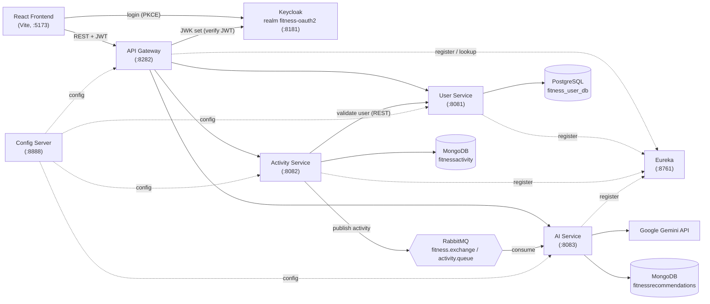
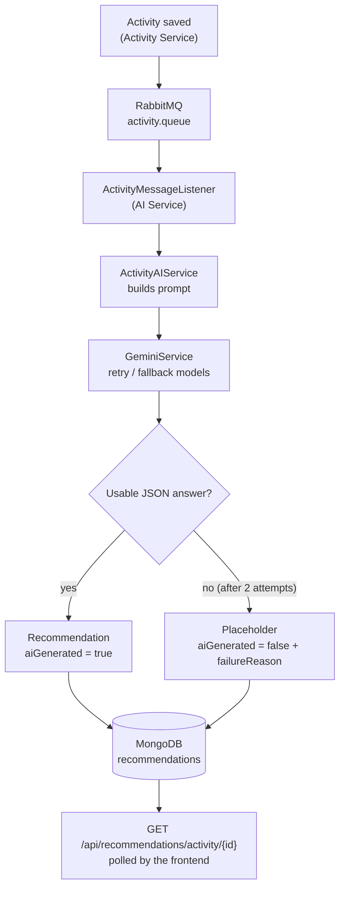
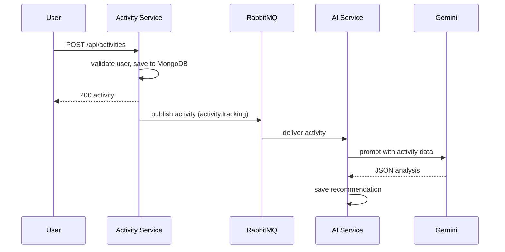
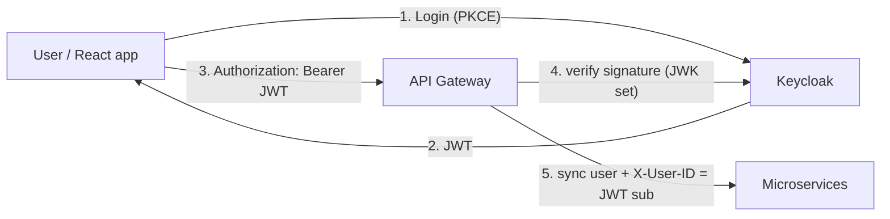

# 🏋️ Fitness Microservices Platform

A fitness tracking platform built with **Spring Boot microservices**, **React**, **Keycloak**, **RabbitMQ**, **PostgreSQL / MongoDB** and **Google Gemini**. Users log workouts and receive an AI-generated analysis and recommendation for each one, produced asynchronously.


---

## 📌 Overview

The platform is split into independent services that are discovered through **Eureka**, configured centrally by **Spring Cloud Config** and exposed to the browser through a single **Spring Cloud Gateway**.

1. A user signs in with **Keycloak** (OAuth2 Authorization Code + PKCE) from the React app.
2. Every API call goes through the **gateway**, which validates the JWT and makes sure the Keycloak user exists in the **user service**.
3. When the user logs an activity, the **activity service** validates the user, stores the activity in MongoDB and publishes it to **RabbitMQ**.
4. The **AI service** consumes the message, sends the activity data to **Gemini**, parses the structured answer and stores the recommendation in MongoDB.
5. The frontend polls for the recommendation and renders it as a detailed report.

Activity logging never waits for the AI: a slow or failing model call cannot break the request that saved the workout.

---

## ✨ Key Features

**Authentication & users**
- Keycloak login with OAuth2 Authorization Code + PKCE (`react-oauth2-code-pkce`)
- JWT validation at the gateway (Spring Security OAuth2 resource server, JWK set from Keycloak)
- Automatic user synchronization: on the first authenticated request the gateway registers the Keycloak user in the user service (keyed by the JWT `sub`)

**Activities**
- Create an activity (type, duration, calories, start time, free-form additional metrics)
- List the current user's activities and fetch a single activity
- Activity types: `RUNNING`, `WALKING`, `CYCLING`, `SWIMMING`, `WEIGHT_TRAINING`, `YOGA`, `HIIT`, `CARDIO`, `STRETCHING`, `OTHER` (the current UI form offers Running, Walking and Cycling)

**AI analysis**
- Gemini-generated analysis per activity: overall analysis, performance insights, improvements, next steps, training recommendations, recovery, nutrition, safety guidelines and a summary
- Activity-type specific prompt focus, and a prompt that forbids inventing data that was not logged
- Retry with backoff, model fallback, response validation and a stored "AI unavailable" placeholder when no analysis can be produced

**Microservice infrastructure**
- API Gateway with load-balanced routes (`lb://`) resolved through Eureka
- Centralized configuration (Config Server, native profile)
- Service-to-service REST calls with a load-balanced `WebClient`
- Asynchronous messaging with RabbitMQ (durable queue, JSON messages)

---

## 🏗️ System Architecture



---

## 🔄 Microservices

| Service | Spring app name | Responsibility | Port |
|---|---|---|---:|
| `configserver` | `config-server` | Serves per-service YAML from its own classpath (`native` profile) | 8888 |
| `eureka` | `eureka` | Service registry | 8761 |
| `gateway` | `api-gateway` | Routing, JWT validation, CORS, Keycloak user sync | 8282 |
| `userservice` | `user-service` | User records, user registration and validation endpoint | 8081 |
| `activityservice` | `activity-service` | Activity storage, user validation, publishes activities to RabbitMQ | 8082 |
| `aiservice` | `ai-service` | Consumes activities, calls Gemini, stores and serves recommendations | 8083 |

Gateway routes (`configserver/.../config/api-gateway.yaml`):

| Path | Target |
|---|---|
| `/api/users/**` | `lb://USER-SERVICE` |
| `/api/activities/**` | `lb://ACTIVITY-SERVICE` |
| `/api/recommendations/**` | `lb://AI-SERVICE` |

---

## 🧠 AI Architecture

**Provider:** Google Gemini, called over REST (`generateContent`) from `GeminiService` using a reactive `WebClient`. The model is configurable (`GEMINI_MODEL`), as is a comma-separated list of fallback models (`GEMINI_FALLBACK_MODELS`); the whole URL can be overridden with `GEMINI_API_URL`. The API key is read from `GEMINI_API_KEY` and is redacted from logs.



**What is sent to the model:** a prompt built from the activity's type, duration, calories burned, calculated calories per minute, start time and additional metrics, plus a short focus statement chosen by activity type. Missing values are reported as "not recorded", and the prompt instructs the model not to invent distance, pace, heart rate, health conditions, etc. The model must reply with JSON only.

**How the answer is processed:**
- The first candidate's text is extracted (thought parts ignored) and the outermost JSON object is parsed, so markdown fences are tolerated.
- The JSON is mapped onto a `Recommendation`: analysis, performance insights, improvements, next steps, training recommendations, recovery, nutrition, safety guidelines, summary.
- If the answer is unusable the service asks once more; if it still fails, a placeholder recommendation is stored with `aiGenerated=false` and a `failureReason` (Gemini's own error, never the key). Configuration problems (bad key, denied project, closed model) are distinguished from temporary outages.

**Gemini call resilience:** 120 s request timeout, up to 2 retries with exponential backoff on HTTP 429/500/502/503/504 and network errors, and fallback to the next configured model when a model is unavailable or quota-limited (an unavailable model is skipped for 10 minutes).

---

## 📨 RabbitMQ / Asynchronous Communication

| Item | Value |
|---|---|
| Exchange | `fitness.exchange` (direct) |
| Queue | `activity.queue` (durable) |
| Routing key | `activity.tracking` |
| Producer | Activity Service (`RabbitTemplate.convertAndSend` after saving the activity) |
| Consumer | AI Service (`@RabbitListener(queues = "activity.queue")`) |
| Serialization | JSON (`Jackson2JsonMessageConverter`) |



Messaging decouples saving a workout from the slow, failure-prone model call. If publishing fails, the error is logged and the activity is still saved and returned to the user. The AI listener catches processing errors, so a failed analysis does not leave the message in a redelivery loop.

---

## 🔐 Security



- **Keycloak realm:** `fitness-oauth2`; the frontend uses the public client `oauth2-pkce-client` (Authorization Code + PKCE, scope `openid profile email offline_access`).
- **Gateway:** `SecurityConfig` requires an authenticated JWT for every request except `/actuator/*`; CSRF is disabled (stateless bearer-token API); CORS allows `http://localhost:5173`.
- **User sync filter:** `KeycloakUserSyncFilter` reads `sub`, `email`, `given_name` and `family_name` from the token, registers the user in the user service if it does not exist yet, and sets the `X-User-ID` header from the verified token subject (taking precedence over any client-supplied header).
- **Downstream services** trust the gateway and identify the user through `X-User-ID`; they do not validate the JWT themselves.

Honest scope notes: a `UserRole` enum (`USER`, `ADMIN`) exists on the user entity, but **no role-based authorization is enforced** anywhere. Secrets are not committed to the repo; the Gemini key comes from the environment.

---

## 🗄️ Database Architecture

Each data-owning service has its own database; no service reads another service's database.

| Service | Store | Database / collection | Contents |
|---|---|---|---|
| User Service | PostgreSQL (JPA/Hibernate, `ddl-auto: update`) | `fitness_user_db` / table `users` | id (UUID), `keycloakId`, unique email, name, role, timestamps |
| Activity Service | MongoDB | `fitnessactivity` / `activities` | userId, type, duration, caloriesBurned, startTime, `metrics`, timestamps |
| AI Service | MongoDB | `fitnessrecommendations` / `recommendations` | activityId, userId, analysis, insight/improvement/next-step/recovery/nutrition/safety lists, summary, `aiGenerated`, `failureReason` |

Relationships are logical only: `activities.userId` holds the Keycloak subject (`users.keycloakId`) and `recommendations.activityId` holds the activity id. There are no cross-database foreign keys. Tables are created automatically by Hibernate on first start.

---

## 🛠️ Tech Stack

| Category | Technology |
|---|---|
| Language | Java 21 (the user service pom targets 17) |
| Framework | Spring Boot 3.5 |
| Microservices | Spring Cloud 2025.0 (Gateway, Netflix Eureka, Config Server) |
| Security | Spring Security OAuth2 resource server, Keycloak (OIDC / JWT) |
| Messaging | RabbitMQ (Spring AMQP) |
| Databases | PostgreSQL (Spring Data JPA), MongoDB (Spring Data MongoDB) |
| Service communication | Spring WebClient (load-balanced) |
| AI | Google Gemini REST API |
| Frontend | React 19, Vite, Material UI, Redux Toolkit, React Router, Axios, `react-oauth2-code-pkce` |
| Build | Maven (wrapper in each service), npm |

---

## 📁 Project Structure

```text
fitnessapp/
├── configserver/          # Spring Cloud Config Server; per-service YAML in src/main/resources/config/
├── eureka/                # Eureka service registry
├── gateway/               # Spring Cloud Gateway: routes, JWT security, Keycloak user sync filter
├── userservice/           # Users (PostgreSQL)
├── activityservice/       # Activities (MongoDB), RabbitMQ producer
├── aiservice/             # RabbitMQ consumer, Gemini integration, recommendations (MongoDB)
├── fitness-app-frontend/  # React + Vite single-page app
└── README.md
```

Each backend service keeps only a minimal `application.yaml` (name + `spring.config.import`); its real configuration (ports, databases, RabbitMQ, Gemini) lives in `configserver/src/main/resources/config/<service>.yaml`.

---

## 🚀 Local Setup

### Prerequisites

- **JDK 21** (set `JAVA_HOME`; Lombok fails on newer JDKs) and the bundled Maven wrapper (`./mvnw`)
- **Node.js 20+** and npm
- **PostgreSQL** on `localhost:5432`
- **MongoDB** on `localhost:27017` (no auth)
- **RabbitMQ** on `localhost:5672`
- **Keycloak** on `localhost:8181`
- A **Gemini API key** from <https://aistudio.google.com/apikey> (needed for AI recommendations)

The repository contains no Dockerfiles or compose file; run the infrastructure locally or with your own `docker run` commands.

### Clone

```bash
git clone https://github.com/DIVYANSHGUPTA-5/-fitness-microservices-app.git
cd ./-fitness-microservices-app
```

### Databases

- PostgreSQL: create the database `fitness_user_db`. The JDBC URL and credentials are set in `configserver/src/main/resources/config/user-service.yaml`; edit that file to match your local PostgreSQL user. Tables are created automatically.
- MongoDB: nothing to create; `fitnessactivity` and `fitnessrecommendations` are created on first write.

### RabbitMQ

Any RabbitMQ with the default local `guest` account works. With Docker:

```bash
docker run -d --name rabbitmq -p 5672:5672 -p 15672:15672 rabbitmq:3-management
```

The exchange, queue and binding are declared by the services at startup. Management UI: <http://localhost:15672>.

### Keycloak

```bash
docker run -d --name keycloak -p 8181:8080 \
  -e KC_BOOTSTRAP_ADMIN_USERNAME=<admin-user> -e KC_BOOTSTRAP_ADMIN_PASSWORD=<admin-password> \
  quay.io/keycloak/keycloak:26.6.1 start-dev
```

In the admin console create:
1. A realm named **`fitness-oauth2`**
2. A **public** client **`oauth2-pkce-client`**: standard flow on, PKCE method `S256`, valid redirect URI `http://localhost:5173/*`, web origin `http://localhost:5173`
3. A user with an **email**, first name and last name (the gateway registers users from these claims)

### Backend

Export the Gemini key in the shell that starts the AI service, then start the services in this order (each in its own terminal, from its own directory):

```bash
export GEMINI_API_KEY=<your-key>        # AI service only

cd configserver     && ./mvnw spring-boot:run   # 1. Config Server  :8888
cd eureka           && ./mvnw spring-boot:run   # 2. Eureka         :8761
cd userservice      && ./mvnw spring-boot:run   # 3. User Service   :8081
cd activityservice  && ./mvnw spring-boot:run   # 4. Activity Svc   :8082
cd aiservice        && ./mvnw spring-boot:run   # 5. AI Service     :8083
cd gateway          && ./mvnw spring-boot:run   # 6. Gateway        :8282
```

The Config Server must be up before the others (they import their config from it). Optional AI settings: `GEMINI_MODEL`, `GEMINI_FALLBACK_MODELS`, `GEMINI_API_URL`.

### Frontend

```bash
cd fitness-app-frontend
npm install
npm run dev        # http://localhost:5173
```

The frontend has the gateway URL (`http://localhost:8282/api`) and Keycloak endpoints hard-coded in `src/services/api.js` and `src/authConfig.js`.

---

## 🌐 Service Ports

| Component | Port |
|---|---:|
| React frontend (Vite) | 5173 |
| API Gateway | 8282 |
| User Service | 8081 |
| Activity Service | 8082 |
| AI Service | 8083 |
| Eureka | 8761 |
| Config Server | 8888 |
| PostgreSQL | 5432 |
| MongoDB | 27017 |
| RabbitMQ (AMQP / management UI) | 5672 / 15672 |
| Keycloak | 8181 |

---

## 🔌 API

All calls go through the gateway (`http://localhost:8282`) with `Authorization: Bearer <JWT>`. The frontend also sends `X-User-ID`, which the gateway overwrites with the token subject.

| Method | Endpoint | Purpose |
|---|---|---|
| POST | `/api/activities` | Create an activity (publishes it to RabbitMQ) |
| GET | `/api/activities` | List the current user's activities |
| GET | `/api/activities/{activityId}` | Get one activity |
| GET | `/api/recommendations/activity/{activityId}` | Recommendation for an activity (404 until the AI service has stored one) |
| GET | `/api/recommendations/user/{userId}` | All recommendations for a user |
| POST | `/api/users/register` | Register a user (used by the gateway sync filter) |
| GET | `/api/users/{userId}` | User profile |
| GET | `/api/users/{userId}/validate` | `true` if a user with that Keycloak id exists, otherwise 404 |

Example request body for `POST /api/activities`:

```json
{
  "type": "RUNNING",
  "duration": 30,
  "caloriesBurned": 300,
  "startTime": "2026-01-01T07:00:00",
  "additionalMetrics": { "distance": 5 }
}
```

---

## 🧪 Testing

- Each service has a Spring Boot context-load test (`*ApplicationTests`); these need the service's runtime dependencies (config server, databases, RabbitMQ) to be reachable.
- `aiservice` has unit tests for the AI logic: `ActivityAIServiceTest` (prompt content, parsing, fenced/odd JSON, retry and placeholder behaviour) and `GeminiServiceTest` (against a local fake HTTP server: retries, model fallback, error classification, key redaction).

```bash
cd aiservice
./mvnw test                                                    # all tests
./mvnw test -Dtest='ActivityAIServiceTest,GeminiServiceTest'   # AI unit tests only

cd ../fitness-app-frontend
npm run lint
npm run build
```

There are no frontend tests and no end-to-end test suite.

---

## 📊 End-to-End Flow

1. The user opens the React app and signs in through Keycloak; the app stores the JWT and the user id (`sub`).
2. The user submits an activity. The request reaches the gateway, which verifies the JWT and registers the user in the user service if needed.
3. The gateway routes `POST /api/activities` to the activity service, which validates the user against the user service, saves the activity in MongoDB and returns it.
4. The activity service publishes the activity to `fitness.exchange` with routing key `activity.tracking`.
5. The AI service consumes it from `activity.queue`, builds the prompt and calls Gemini.
6. The parsed recommendation (or the unavailable placeholder) is saved in MongoDB.
7. The activity detail page polls `GET /api/recommendations/activity/{id}` every 3 seconds (up to 40 times) and renders the analysis, insights, improvements, next steps, training, recovery, nutrition, safety and summary sections.

---

## 🧩 Engineering Highlights

- **Microservices with database-per-service**: PostgreSQL for relational user data, MongoDB for activity and recommendation documents.
- **Service discovery and client-side load balancing**: Eureka plus `lb://` gateway routes and a `@LoadBalanced` `WebClient`.
- **Centralized configuration** via Spring Cloud Config.
- **Event-driven processing**: RabbitMQ decouples activity ingestion from AI analysis.
- **OAuth2 / OIDC with PKCE** and stateless JWT validation at the edge; the identity used downstream comes from the verified token.
- **Defensive LLM integration**: strict JSON contract, tolerant parsing, retries with backoff, model fallback, failure classification, secret redaction, and a graceful stored fallback instead of an error.
- **Tested integration code**: the Gemini client is tested against a fake HTTP server, including failure modes.

---

## 🔮 Future Improvements

These are **planned ideas, not existing features**.

- Role-based authorization (the `ADMIN`/`USER` role exists but is unused) and JWT validation in downstream services
- Ownership checks on activity lookups by id
- Containerization (Dockerfiles / Docker Compose) and CI/CD
- Dead-letter queue and retry policy for failed AI messages
- Distributed tracing and centralized logging
- Gateway rate limiting
- Notification when a recommendation becomes ready, replacing frontend polling
- Externalized configuration and secrets for non-local environments

---

## 👨‍💻 Author

**Divyansh Gupta**  
GitHub: [DIVYANSHGUPTA-5](https://github.com/DIVYANSHGUPTA-5)

---

## 📄 License

No license file is included in this repository.
